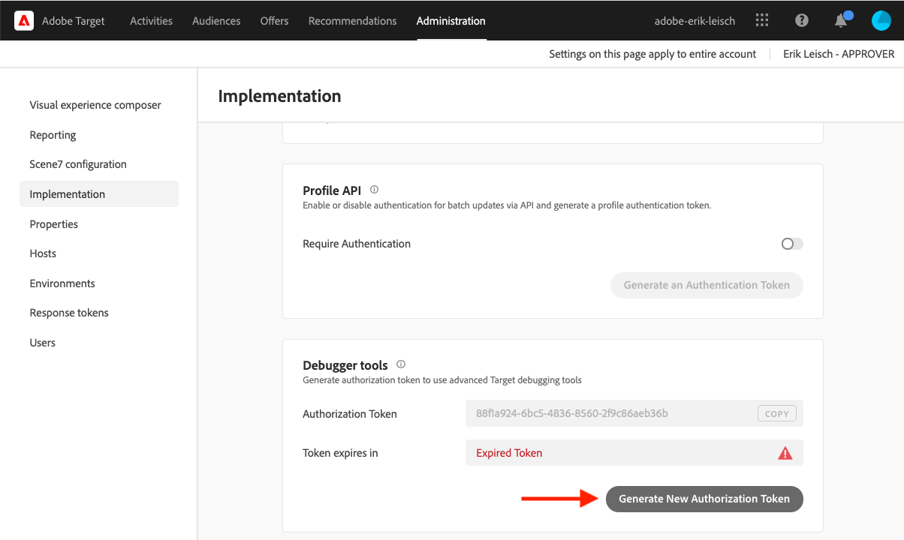
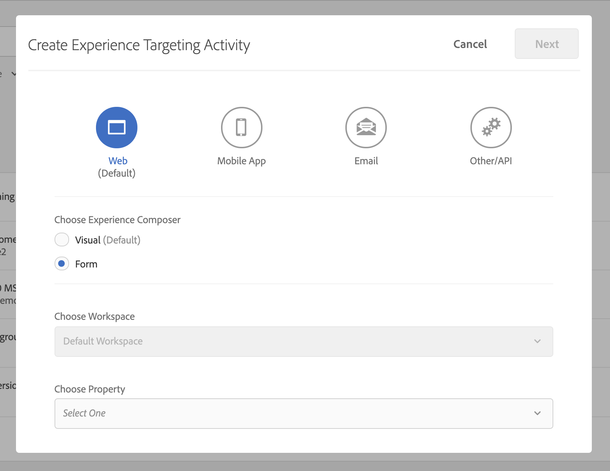
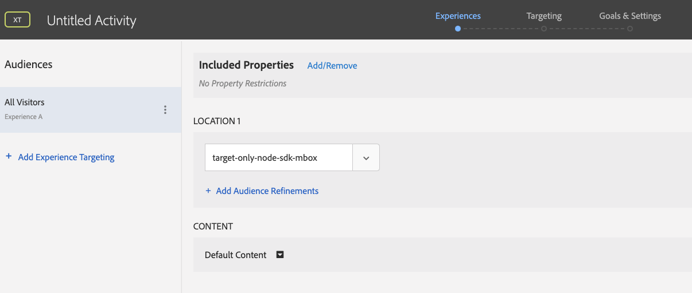
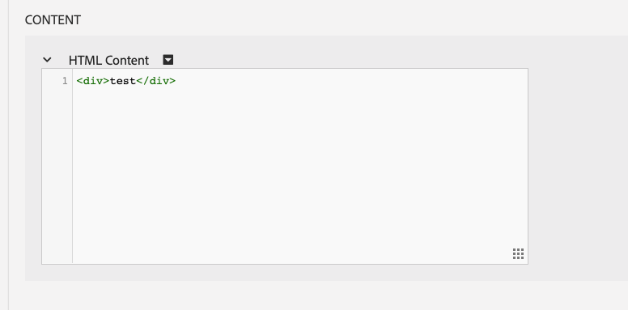
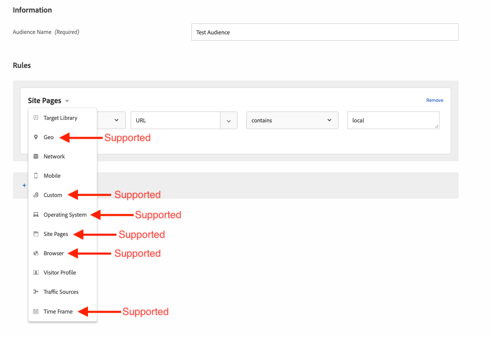
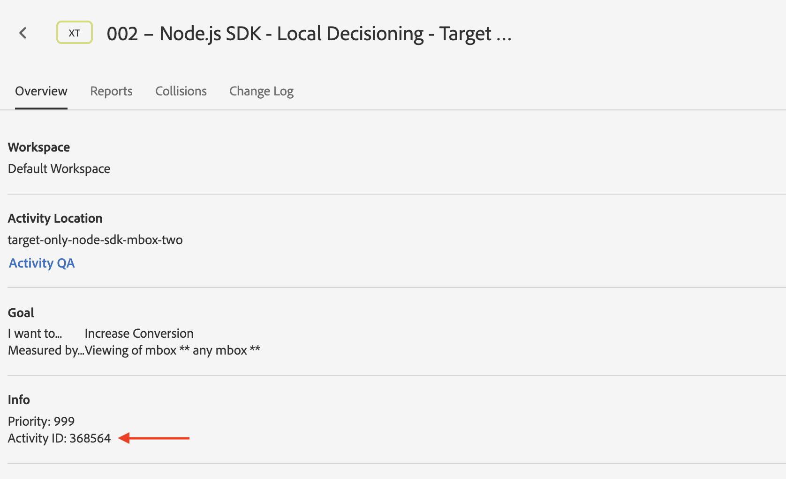

# Troubleshooting

## Validating Configuration

### Summary of Steps

1. Ensure the `logger` is configured
1. Ensure Target Traces is enabled
1. Verify the on-device decisioning *rule artifact* has been retrieved and cached according to the polling interval defined.
1. Validate content delivery via the cached rule artifact by creating a test on-device decisioning activity through the form-based experience composer.

## Ensure the logger is configured

When initializing the SDK, ensure that you enable logging.


**Node.js**

For Node.js SDK a `logger` object should be provided.

```js
const CONFIG = {
  client: "<your client code>",
  organizationId: "<your organization ID>",
  logger: console
};
```

**Java SDK**

For Java SDK `logRequests` on the `ClientConfig` should be enabled.

```javascript
ClientConfig config = ClientConfig.builder()
  .client("<your client code>")
  .organizationId("<your organization ID>")
  .logRequests(true)
  .build();
```

Also the JVM should be started with the following command line parameter:

```javascript
$ java -Dorg.slf4j.simpleLogger.defaultLogLevel=DEBUG ...
```

## Ensure Target Traces is enabled

Enabling traces will output additional information from Adobe Target in regards to the rules artifact.

1. Navigate to the Target UI in Experience Cloud.
  
   

1. Navigate to **Administration** > **Implementation** and click **Generate New Authorization Token**.
  
   

1. Copy the newly generated authorization token to the clipboard and add it to your Target request:

**Node.js**

```js
const request = {
  trace: {
    authorizationToken: "88f1a924-6bc5-4836-8560-2f9c86aeb36b"
  },
  execute: {
    mboxes: [{
      name: "sdk-mbox"
    }]
}};
```

**Java SDK**

```javascript
Trace trace = new Trace()
  .authorizationToken("88f1a924-6bc5-4836-8560-2f9c86aeb36b");
Context context = new Context()
  .channel(ChannelType.WEB);
MboxRequest mbox = new MboxRequest()
  .name("sdk-mbox")
  .index(0);
ExecuteRequest executeRequest = new ExecuteRequest()
  .mboxes(Arrays.asList(mbox));

TargetDeliveryRequest request = TargetDeliveryRequest.builder()
  .trace(trace)
  .context(context)
  .execute(executeRequest)
  .build();
```

1. With the logger and trace in place, start your app and monitor the server terminal. The following output from the logger confirms that the rule artifact has been retrieved:

**Node.js SDK**

```js
  AT: LD.ArtifactProvider fetching artifact - https://assets.adobetarget.com/your-client-code/production/v1/rules.json
  AT: LD.ArtifactProvider artifact received - status=200
```


1. Wait the duration of the polling interval (default is 5 minutes) and ensure that the artifact is being fetched by the SDK. The same terminal logs will be output.

   Additionally, information from the the Target Trace should be outputted to the terminal with details about the rule artifact.

``` 
"trace": {
   "clientCode": "your-client-code",
   "artifact": {
     "artifactLocation": "https://assets.adobetarget.com/your-client-code/production/v1/rules.json",
     "pollingInterval": 300000,
     "pollingHalted": false,
     "artifactVersion": "1.0.0",
     "artifactRetrievalCount": 10,
     "artifactLastRetrieved": "2020-09-20T00:09:42.707Z",
     "clientCode": "your-client-code",
     "environment": "production",
     "generatedAt": "2020-09-22T17:17:59.783Z"
   },
```
## Validate content delivery via the cached rule artifact by creating a test on-device decisioning activity through the form-based experience composer.

1. Navigate to the Target UI in Experience Cloud

    

1. Create a new XT activity using the Form-based Experience Composer.

    

1. Input the mbox name used in your Target request as the location for the XT activity (note this should be a unique mbox name specifically for development purposes).

    

1. Change the content to either an HTML offer or JSON offer. This will be returned in the Target request to your application. Leave targeting for the activity as 'All Visitors' and select any metric you would like. Name the activity, save it, and then activate it to ensure the mbox/location in use is only for development.

   

1. In your application, add a log statements for the content received in the response from your Target request

**Node.js SDK**

```
try {
  const response = await targetClient.getOffers({ request });
  console.log('Response: ', response.response.execute.mboxes[0].options[0].content);
} catch (error) {
  console.error('Something went wrong', error);
}
```

**Java SDK**

```
try {
  Context context = new Context()
    .channel(ChannelType.WEB);
  MboxRequest mbox = new MboxRequest()
    .name("sdk-mbox")
    .index(0);
  ExecuteRequest executeRequest = new ExecuteRequest()
    .mboxes(Arrays.asList(mbox));

  TargetDeliveryRequest request = TargetDeliveryRequest.builder()
    .context(context)
    .decisioningMethod(DecisioningMethod.ON_DEVICE)
    .execute(executeRequest)
    .build();

    TargetDeliveryResponse response = targetClient.getOffers(request);
  logger.debug("Response: ", response.getResponse().getExecute().getMboxes().get(0).getOptions().get(0).getContent());
} catch (Exception exception) {
  logger.error("Something went wrong", exception);
}
```

1. Review the logs in your terminal to verify that your content is being delivered and that it was delivered via the rules artifact on your server. The `LD.DeciscionProvider` object is outputted when the activity qualification and decisioning were determined on-device based on the rules artifact. Furthermore, due to the logging of the `content`, you should see `<div>test</div>` or however you have decided the response to be when creating the test activity.

**Logger output**

```
AT: LD.DecisionProvider {...}
AT: Response received {...}
Response:  <div>test</div>
```

## Common Troubleshooting Scenarios

<InlineAlert variant="info" slots="text"/>

Please be sure to review [supported features](supported-features.md) for on-device decisioning when running into issues.

### On-device decisioning activities not executing due to unsupported audience or activity

A common issue that can occur is on-device decisioning activities not executing due to the audience in use or the activity type being unsupported.

(1) Using the logger output, review the entries in the trace property in your response object. Specifically identify the campaigns property:

**Trace output**

```
  "execute": {
  "mboxes": [
    {
      "name": "your-mbox-name",
      "index": 0,
      "trace": {
        "clientCode": "your-client-code",
        ...
        "campaigns": [],
        ...
      }
    }
```

You will notice that the activity you are trying to qualify for is not in the `campaigns` property since the audience or activity type is not supported. If the activity is listed under the `campaigns` property, your issue is not due to an unsupported audience or activity type.

(2) Additionally, locate the `rules.json` file by looking at the `trace` > `artifact` > `artifactLocation` in your logger output and notice that your activity is missing from the `rules` > `mboxes` property:

**Logger output**

```
 ...
 rules: {
   mboxes: { },
   views: { }
 }
```

Finally, navigate to the Target UI and locate the activity in question: [experience.adobe.com/target](https://experience.adobe.com/target)

Review the rules used in the audience and ensure you only use those aforementioned that are supported. Additionally, ensure that the activity type is either A/B or XT.



### On-device decisioning activities not executing due to unqualified audience

If an on-device decisioning activity is not executing, but you have verified that your rules.json file contains the activity, run through the following steps:

(1) Ensure that the mbox you are executing in your application is the same one the activity is using:

**rules.json**

```json
 ...
 rules: {
   mboxes: {
    target-only-node-sdk-mbox: [{ // this mbox name must match the mbox in your request
      ...
    }]
   }
 ...
 ```

 **Node.js SDK**

 ```js
 const request = {
   trace: {
     authorizationToken: '2dfc1dce-1e58-4e05-bbd6-a6725893d4d6'
   },
   execute: {
     mboxes: [{
       address: getAddress(req),
       name: "target-only-node-sdk-mbox-two" // this mbox name must match the mbox the activity is using
     }]
   }};
```

**Java SDK**

```javascript
Context context = new Context()
  .channel(ChannelType.WEB);
MboxRequest mbox = new MboxRequest()
  .name("target-only-node-sdk-mbox-two")
  .index(0);
ExecuteRequest executeRequest = new ExecuteRequest()
  .mboxes(Arrays.asList(mbox));

TargetDeliveryRequest request = TargetDeliveryRequest.builder()
  .context(context)
  .decisioningMethod(DecisioningMethod.ON_DEVICE)
  .execute(executeRequest)
  .build();

TargetDeliveryResponse response = targetClient.getOffers(request);
```

(2) Ensure that you are qualified for the audience for you activity by reviewing the `matchedRuleConditions` or `unmatchedRuleConditions` property of your trace output:

**Trace output**

```
...
},
"campaignId": 368564,
"campaignType": "landing",
"matchedSegmentIds": [],
"unmatchedSegmentIds": [
  6188838
      ],
      "matchedRuleConditions": [],
          "unmatchedRuleConditions": [
            {
              "in": [
                "true",
                {
                  "var": "mbox.auth_lc"
                }
              ]
            }
          ]
    ...
```

If you have unmatched rule conditions, you are not qualified for the activity and thus the activity will not execute. Review the rules in your audience to see why you are not qualifying.

### On-device decisioning activity not executing, but reason not apparent

It may not be readily apparent why an on-device decisioning activity is not executing. In this case, follow these troubleshooting steps to identify the issue:

(1) Read through the logger trace output in your console and identify the artifact property, which will look similar to the following:

**Trace output**

```
...
      "artifact": {
          "artifactLocation": "https://assets.adobetarget.com/your-client-code/production/v1/rules.json",
          "pollingInterval": 300000,
          "pollingHalted": false,
          "artifactVersion": "1.0.0",
          "artifactRetrievalCount": 3,
          "artifactLastRetrieved": "2020-10-16T00:56:27.596Z",
          "clientCode": "adobeinterikleisch",
          "environment": "production"
        },
...
```

Look at the `artifactLastRetrieved` date of the artifact and ensure that you have the latest `rules.json` file downloaded to your app.

(2) Find the `evaluatedCampaignTargets` property in your logger output:

**Logger output**

```
... 
  "evaluatedCampaignTargets": [
      {
        "context": {
          "current_timestamp": 1602812599608,
          "current_time": "0143",
          "current_day": 5,
          "user": {
            "browserType": "unknown",
            "platform": "Unknown",
            "locale": "en",
            "browserVersion": -1
          },
          "page": {
            "url": "localhost:3000/",
            "path": "/",
            "query": "",
            "fragment": "",
            "subdomain": "",
            "domain": "3000",
            "topLevelDomain": "",
            "url_lc": "localhost:3000/",
            "path_lc": "/",
            "query_lc": "",
            "fragment_lc": "",
            "subdomain_lc": "",
            "domain_lc": "3000",
            "topLevelDomain_lc": ""
          },
          "referring": {
            "url": "localhost:3000/",
            "path": "/",
            "query": "",
            "fragment": "",
            "subdomain": "",
            "domain": "3000",
            "topLevelDomain": "",
            "url_lc": "localhost:3000/",
            "path_lc": "/",
            "query_lc": "",
            "fragment_lc": "",
            "subdomain_lc": "",
            "domain_lc": "3000",
            "topLevelDomain_lc": ""
          },
          "geo": {},
          "mbox": {},
          "allocation": 23.79
        },
        "campaignId": 368564,
        "campaignType": "landing",
        "matchedSegmentIds": [],
        "unmatchedSegmentIds": [
          6188838
        ],
        "matchedRuleConditions": [],
        "unmatchedRuleConditions": [
          {
            "in": [
              "true",
              {
                "var": "mbox.auth_lc"
              }
            ]
          }
        ]
...
```

(3) Review the `context`, `page`, and `referring` data to ensure it is as expected as this can affect the targeting qualification of the activity.

(4) Review the `campaignId` to ensure the activity or activities you are expecting to execute are evaluated. The `campaignId` will match the activity ID on the activity overview tab in the Target UI:



(5) Review the `matchedRuleConditions` and `unmatchedRuleConditions` to identify issues with qualifying for the audience rules for a given activity.

(6) Review the latest `rules.json` file to ensure the activity or activities you want to execute locally are included. The location is referenced above in step 1.

(7) Ensure you are using the same mbox names in your request and activities.

(8) Ensure you are using supported audience rules and supported activity types.