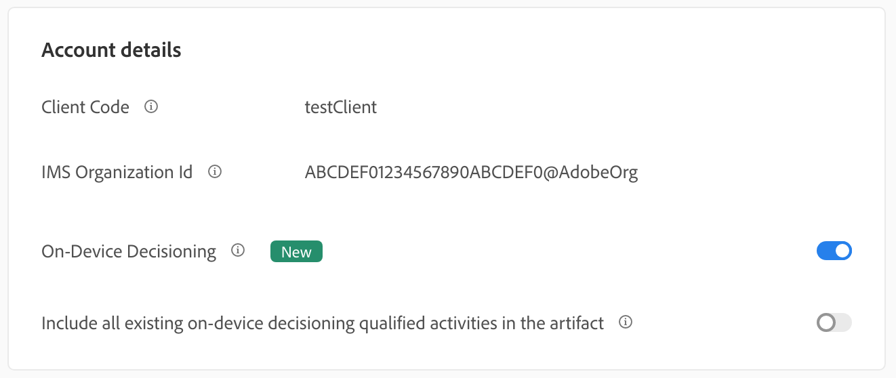

# Deliver personalization

## Summary of steps

1. Enable On-Device Decisioning for your organization
1. Create an Experience Targeting (XT) activity
1. Define personalized experience per audience
1. Verify personalized experience per audience
1. Set up reporting
1. Add metrics for tracking KPIs
1. Implement personalized offers in your application
1. Implement code to track conversion events
1. Activate your XT personalization activity

Suppose you are a touring company. You want to deliver a personalized offer of 25% off certain travel packages. In order for the offer to resonate with your users, you decide to show a landmark of the destination city. You also want to ensure that delivery of your personalized offers is executed at near-zero latency so it doesn't negatively impact user experiences and skew the results.

## Enable On-Device Decisioning for your organization

1. Enabling on-device decisioning ensures an A/B activity is executed at near-zero latency. To enable this feature, navigate to **Administration** > **Implementation** > **Account details** in Adobe Target, and enable the **On-Device Decisioning** toggle.

   <!--*Insert image-odd4.png*-->
    

   **NOTE**: You must have the Admin or Approver [user role](https://docs.adobe.com/content/help/en/target/using/administer/manage-users/user-management.html) to enable or disable the On-Device Decisioning toggle.

   After enabling the **On-Device Decisioning** toggle, Adobe Target begins generating *rule artifacts* for your client.

## Create an Experience Targeting (XT) activity

1. In Adobe Target, navigate to the **Activities** page, then select **Create Activity** > **Experience Targeting**.

  *Insert image-xt.png*

1. In the **Create Experience Targeting Activity** modal, leave the default **Web** option selected (1), select **Form** as your experience composer (2), select a workspace and property (3), and click **Next** (4).

   *Insert image-xt-next.png*

## Define a personalized experience per audience

1. In the **Experiences** step of activity creation, click **Change Audience** to create an audience of those visitors who want to travel to San Francisco, California.

   *Insert image-change-audience.png*

1. In the **Create Audience** modal, define a custom rule where `destinationCity = San Francisco`. This defines the group of users who want to travel to San Francisco.

   *Insert image-audience-sf.png*

1. Still in the **Experiences** step, enter the name of the location (1) within your application where you want to render a special offer regarding the Golden Gate Bridge, but only for those headed to San Francisco. In the example shown here, homepage is the location selected for the HTML offer (2), which is defined in the **Content** area.

   *Insert image-content-sf.png*

1. Add another targeting audience by clicking **Add Experience Targeting**. This time, target an audience that would like to travel to New York by defining an audience rule where `destinationCity = New York`. Define the location within your application where you want to render a special offer regarding the Empire State Building. In the example shown here, `homepage` is the location selected for the HTML offer (2), which is defined in the **Content** area.

   *Insert image-content-ny.png*

## Verify personalized experience per audience

In the **Targeting** step, verify you have configured the desired personalized experience per audience.

  *Insert image-verify-sf-ny.png*

## Set up reporting

In the **Goals & Settings** step, choose **Adobe Target** as the **Reporting Source** to view activity results in the Adobe Target UI, or choose **Adobe Analytics** to view them in the Adobe Analytics UI.

*Insert image-reporting-sf-ny.png*

## Add metrics for tracking KPIs

Choose a **Goal Metric** to measure the success of the activity. In this example, a successful conversion is based on whether the user clicks on the personalized destination offer.

## Implement your personalized offers in your application

**Node.js**

```
const TargetClient = require("@adobe/target-nodejs-sdk");

const CONFIG = {
  client: "acmeclient",
  organizationId: "1234567890@AdobeOrg"
};

const targetClient = TargetClient.create(CONFIG);

targetClient.getOffers({
  request: {      
    execute: {
      pageLoad: {
        parameters: {
          destinationCity: "San Francisco"
        }
      }
    }       
  }
})
.then(console.log)
.catch(console.error);
```

**Java**

```
ClientConfig config = ClientConfig.builder()
  .client("acmeclient")
  .organizationId("1234567890@AdobeOrg")
  .build();
TargetClient targetClient = TargetClient.create(config);

Context context = new Context().channel(ChannelType.WEB);

ExecuteRequest executeRequest = new ExecuteRequest();

RequestDetails pageLoad = new RequestDetails();
pageLoad.setParameters(
    new HashMap<String, String>() {
      {
        put("destinationCity", "San Francisco");
      }
    });

executeRequest.setPageLoad(pageLoad);

TargetDeliveryRequest request = TargetDeliveryRequest.builder()
  .context(context)
  .execute(executeRequest)
  .build();

TargetDeliveryResponse offers = targetClient.getOffers(request);
```

## Implement code to track conversion events

**Node.js**

```
//... Code removed for brevity

//When a conversion happens
TargetClient.sendNotifications({
    targetCookie,
    "request" : {
      "notifications" : [
        {
          type: "click",
          timestamp : Date.now(),
          id: "conversion",
          mbox : {
            name : "destinationOffer"
          }
        }
      ]
    }
})
```

**Java**

```
ClientConfig config = ClientConfig.builder()
  .client("acmeclient")
  .organizationId("1234567890@AdobeOrg")
  .build();
TargetClient targetClient = TargetClient.create(config);

Context context = new Context().channel(ChannelType.WEB);

ExecuteRequest executeRequest = new ExecuteRequest();

RequestDetails pageLoad = new RequestDetails();
pageLoad.setParameters(
    new HashMap<String, String>() {
      {
        put("destinationCity", "San Francisco");
      }
    });

executeRequest.setPageLoad(pageLoad);
NotificationDeliveryService notificationDeliveryService = new NotificationDeliveryService();

Notification notification = new Notification();
notification.setId("conversion");
notification.setImpressionId(UUID.randomUUID().toString());
notification.setType(MetricType.CLICK);
notification.setTimestamp(System.currentTimeMillis());
notification.setTokens(
    Collections.singletonList(
        "IbG2Jz2xmHaqX7Ml/YRxRGqipfsIHvVzTQxHolz2IpSCnQ9Y9OaLL2gsdrWQTvE54PwSz67rmXWmSnkXpSSS2Q=="));

TargetDeliveryRequest targetDeliveryRequest =
    TargetDeliveryRequest.builder()
        .context(context)
        .execute(executeRequest)
        .notifications(Collections.singletonList(notification))
        .build();

TargetDeliveryResponse offers = targetClient.getOffers(request);
notificationDeliveryService.sendNotification(request);
```

## Activate your experience targeting (XT) activity

*Insert image-xt-activate.png*